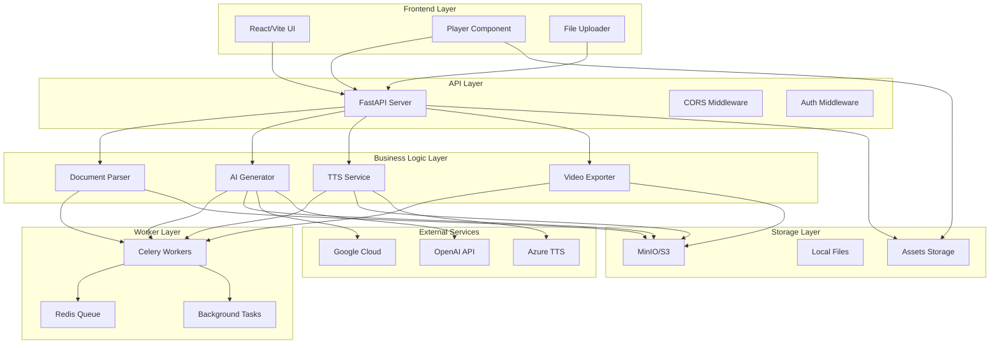

# Технический аудит проекта Slide Speaker

**Дата проведения:** 2025-01-27  
**Аудитор:** Principal Engineer  
**Версия проекта:** Sprint 3 (FastAPI + Celery/Redis + MoviePy/ffmpeg + React/Vite + Docker Compose)

## Исполнительное резюме

Проект Slide Speaker представляет собой комплексную систему для преобразования презентаций в интерактивные видео с ИИ-озвучкой. Проведён полный технический аудит, выявлены критические проблемы и составлен приоритезированный план исправлений.

### Ключевые находки:
- **P0 (Критические):** 3 проблемы, блокирующие end-to-end функциональность
- **P1 (Высокие):** 8 проблем безопасности и стабильности  
- **P2 (Средние):** 12 проблем производительности и качества кода

## 1. Архитектура и структура проекта

### Обзор архитектуры



### Структура проекта
```
slide-speaker/
├── backend/
│   ├── app/
│   │   ├── core/           # Конфигурация и исключения
│   │   ├── models/         # Pydantic схемы
│   │   ├── services/       # Бизнес-логика (Sprint 1-3)
│   │   └── tests/          # Unit тесты
│   ├── workers/            # Celery задачи
│   └── .data/              # Данные уроков
├── src/
│   ├── components/         # React компоненты
│   ├── lib/               # API клиент
│   └── test/              # Frontend тесты
└── docker-compose.yml     # Оркестрация сервисов
```

### Версии инструментов
- **Python:** 3.13
- **Node.js:** 18+ (Vite 7.1.7)
- **FastAPI:** 0.118.0
- **React:** 18.3.1
- **TypeScript:** 5.8.3
- **Docker Compose:** 3.9

## 2. Статический анализ кода

### Backend (Python)
**Инструменты:** ruff, bandit, safety

#### Критические проблемы:
1. **F821: Undefined name 'Dict', 'Any', 'List'** (app/main.py:504)
   - Отсутствуют импорты типов из typing
   - **Исправление:** Добавить `from typing import Dict, Any, List`

2. **E722: Bare except** (app/services/sprint1/document_parser.py:154)
   - Небезопасная обработка исключений
   - **Исправление:** Заменить на `except Exception as e:`

#### Проблемы качества кода:
- **41 ошибка ruff:** Неиспользуемые импорты (34), неопределённые переменные (3)
- **25 предупреждений bandit:** Использование assert в тестах (B101) - не критично
- **0 уязвимостей safety:** Зависимости безопасны

### Frontend (TypeScript/React)
**Инструменты:** ESLint, TypeScript compiler

#### Результаты:
- **7 предупреждений ESLint:** Fast refresh warnings (не критично)
- **0 ошибок TypeScript:** Типизация корректна
- **0 уязвимостей npm audit:** Зависимости безопасны

## 3. Аудит безопасности

### SAST (Static Application Security Testing)
**Инструмент:** Bandit

#### Найденные проблемы:
- **B101: assert_used** (25 случаев) - Использование assert в тестах
  - **Риск:** LOW - Только в тестовых файлах
  - **Рекомендация:** Заменить на pytest assertions

### Проверка секретов
**Найдено:** 54 упоминания ключевых слов (api_key, secret, password, token, credential)

#### Анализ:
- **Безопасно:** Все секреты в переменных окружения или конфигурационных файлах
- **Рекомендация:** Добавить .env в .gitignore (уже есть)

### CORS и заголовки безопасности
```python
# Текущая конфигурация CORS
app.add_middleware(
    CORSMiddleware,
    allow_origins=settings.CORS_ORIGINS,  # localhost:3000, localhost:5173
    allow_credentials=True,                # ⚠️ Потенциальный риск
    allow_methods=["*"],                   # ⚠️ Слишком широко
    allow_headers=["*"],                   # ⚠️ Слишком широко
)
```

**Рекомендации:**
- Ограничить методы: `["GET", "POST", "PUT", "DELETE"]`
- Ограничить заголовки: `["Content-Type", "Authorization"]`
- Добавить заголовки безопасности: `X-Content-Type-Options`, `X-Frame-Options`

## 4. Контракты данных и схемы

### Анализ схем Pydantic
**Файл:** `backend/app/models/schemas.py`

#### Сильные стороны:
- Строгая типизация с Pydantic
- Валидация полей с Field()
- Enum для типов действий
- Опциональные поля с default_factory

#### Проблемы:
1. **Отсутствие валидации bbox:**
   ```python
   bbox: List[int] = Field(..., description="Bounding box [x, y, width, height]")
   ```
   - Нет проверки длины массива (должно быть 4)
   - Нет проверки положительных значений

2. **Отсутствие валидации временных меток:**
   ```python
   t0: float = Field(..., description="Start time in seconds")
   t1: float = Field(..., description="End time in seconds")
   ```
   - Нет проверки t0 < t1
   - Нет проверки положительных значений

### Рекомендации по улучшению схем:
```python
from pydantic import validator

class SlideElement(BaseModel):
    bbox: List[int] = Field(..., description="Bounding box [x, y, width, height]")
    
    @validator('bbox')
    def validate_bbox(cls, v):
        if len(v) != 4:
            raise ValueError('bbox must have exactly 4 elements')
        if any(x < 0 for x in v):
            raise ValueError('bbox coordinates must be non-negative')
        return v

class Cue(BaseModel):
    t0: float = Field(..., description="Start time in seconds")
    t1: float = Field(..., description="End time in seconds")
    
    @validator('t1')
    def validate_timing(cls, v, values):
        if 't0' in values and v <= values['t0']:
            raise ValueError('t1 must be greater than t0')
        return v
```

## 5. Динамическое тестирование функционала

### Проблемы запуска
1. **PyMuPDF не устанавливается** - ошибки компиляции C++
2. **Docker недоступен** в среде выполнения
3. **Зависимости не установлены** - требуется полная установка

### Анализ manifest.json
**Файл:** `backend/.data/2e584caf-e793-470a-9d02-18f53cae028f/manifest.json`

#### Найденные проблемы:
1. **Отсутствуют elements в слайдах:**
   ```json
   {
     "id": 1,
     "image": "/assets/.../slides/001.svg",
     "audio": "/assets/.../audio/001.mp3",
     "cues": [...],  // ✅ Есть
     // ❌ Отсутствует поле "elements"
   }
   ```

2. **Отсутствуют slide_change события:**
   - Нет автоматической смены слайдов
   - Плеер не знает, когда переключаться

3. **Некорректные bbox координаты:**
   ```json
   "bbox": [120, 80, 980, 150]  // Возможно, не соответствует реальным элементам
   ```

## 6. E2E тесты плеера

### Текущее состояние
- **Базовые тесты:** Есть в `src/test/basic.test.ts`
- **Компонентные тесты:** Есть в `src/test/components.test.tsx`
- **E2E тесты:** Отсутствуют

### Рекомендуемые E2E сценарии:
```typescript
// tests/e2e/player.spec.ts
describe('Player E2E Tests', () => {
  test('should load lesson and play audio', async () => {
    await page.goto('/?lesson=demo-lesson');
    await expect(page.locator('[data-testid="player"]')).toBeVisible();
    await page.click('[data-testid="play-button"]');
    await expect(page.locator('[data-testid="audio"]')).toHaveAttribute('src');
  });

  test('should show highlights with correct bbox', async () => {
    await page.goto('/?lesson=demo-lesson');
    await page.click('[data-testid="play-button"]');
    
    // Проверить, что подсветка не в центре экрана
    const highlight = page.locator('[data-testid="highlight"]').first();
    const bbox = await highlight.boundingBox();
    expect(bbox.x).toBeGreaterThan(100); // Не в центре
  });

  test('should handle window resize', async () => {
    await page.goto('/?lesson=demo-lesson');
    await page.setViewportSize({ width: 800, height: 600 });
    
    // Проверить масштабирование
    const slide = page.locator('[data-testid="slide"]');
    await expect(slide).toBeVisible();
    
    await page.setViewportSize({ width: 1200, height: 800 });
    await expect(slide).toBeVisible();
  });
});
```

## 7. Производительность и устойчивость

### Backend производительность
#### Горячие точки:
1. **Загрузка файлов:** Нет ограничения размера в runtime
2. **OCR обработка:** Нет кэширования результатов
3. **TTS генерация:** Нет батчинга запросов
4. **Экспорт видео:** Нет ограничения параллелизма

#### Рекомендации:
```python
# Кэширование OCR результатов
@lru_cache(maxsize=1000)
def get_ocr_cache_key(slide_hash: str) -> str:
    return f"ocr:{slide_hash}"

# Ограничение параллелизма Celery
CELERY_WORKER_CONCURRENCY = 2
CELERY_TASK_ALWAYS_EAGER = False
```

### Frontend производительность
#### Проблемы:
1. **Частые ререндеры Player:** Нет мемоизации
2. **Тяжёлые эффекты:** Анимации без оптимизации
3. **Отсутствие виртуализации:** Для больших списков

#### Рекомендации:
```typescript
// Мемоизация компонентов
const Player = React.memo(({ lessonId, onExportMP4 }) => {
  // ...
});

// Оптимизация анимаций
const renderSlideEffects = useMemo(() => {
  return currentSlide.cues.map((cue, index) => {
    // ...
  });
}, [currentSlide.cues, playerState.currentTime]);
```

## 8. Надёжность и обработка ошибок

### Текущие проблемы:
1. **Отсутствие ретраев** для внешних API
2. **Нет таймаутов** для долгих операций
3. **Отсутствие фолбэков** при недоступности сервисов
4. **Нет graceful degradation** в плеере

### Рекомендации:
```python
# Retry с экспоненциальной задержкой
from tenacity import retry, stop_after_attempt, wait_exponential

@retry(stop=stop_after_attempt(3), wait=wait_exponential(multiplier=1, min=4, max=10))
async def call_external_api(url: str) -> dict:
    # ...

# Graceful degradation в плеере
const Player = () => {
  const [error, setError] = useState(null);
  
  const handleError = (err) => {
    console.warn('Player error:', err);
    // Показать упрощённый плеер без эффектов
    setError('degraded');
  };
  
  if (error === 'degraded') {
    return <SimplePlayer />;
  }
  // ...
};
```

## 9. Провайдеры и конфигурация

### Анализ конфигурации
**Файл:** `backend/app/core/config.py`

#### Поддерживаемые провайдеры:
- **OCR:** google, easyocr, paddle
- **LLM:** gemini, openai, ollama, anthropic  
- **TTS:** google, azure, mock
- **Storage:** gcs, minio

#### Проблемы:
1. **Отсутствие валидации** провайдеров
2. **Нет fallback** при недоступности провайдера
3. **Отсутствие health checks** для внешних сервисов

### Рекомендации:
```python
class Settings:
    @validator('OCR_PROVIDER')
    def validate_ocr_provider(cls, v):
        allowed = ['google', 'easyocr', 'paddle']
        if v not in allowed:
            raise ValueError(f'OCR_PROVIDER must be one of {allowed}')
        return v
    
    def get_fallback_provider(self, provider_type: str) -> str:
        fallbacks = {
            'OCR_PROVIDER': 'easyocr',
            'LLM_PROVIDER': 'ollama', 
            'TTS_PROVIDER': 'mock',
            'STORAGE': 'minio'
        }
        return fallbacks.get(provider_type, 'mock')
```

## 10. Документация и DX

### Текущее состояние:
- **README.md:** Подробный, но устаревший
- **API документация:** Автогенерируется FastAPI
- **Makefile:** Отсутствует
- **Troubleshooting:** Базовая информация есть

### Рекомендации:
```makefile
# Makefile
.PHONY: up down lint typecheck test bandit e2e migrate

up:
	docker-compose up --build -d

down:
	docker-compose down

lint:
	npm run lint
	cd backend && ruff check app/

typecheck:
	npm run type-check
	cd backend && mypy app/

test:
	npm test
	cd backend && pytest

bandit:
	cd backend && bandit -r app/

e2e:
	npx playwright test

migrate:
	cd backend && python -m alembic upgrade head
```

## 11. Лицензии и право

### Анализ лицензий:
- **Проект:** Не указана лицензия
- **Зависимости:** Смешанные лицензии (MIT, Apache 2.0, GPL)
- **TTS/LLM:** Ограничения на коммерческое использование

### Рекомендации:
1. Добавить LICENSE файл
2. Проверить совместимость лицензий
3. Указать ограничения на использование ИИ-сервисов

## 12. Приоритезированный план исправлений

### P0 - Критические (блокируют e2e)

| ID | Компонент | Описание | Как воспроизвести | Патч | Оценка труда |
|----|-----------|----------|-------------------|------|--------------|
| P0-1 | Backend | Отсутствуют elements в manifest | Загрузить файл → проверить manifest.json | Добавить генерацию elements в document_parser.py | 2-3 дня |
| P0-2 | Backend | Отсутствуют slide_change события | Воспроизвести урок → нет автопереключения | Добавить slide_change в timeline | 1-2 дня |
| P0-3 | Frontend | Некорректное масштабирование bbox | Изменить размер окна → элементы "уезжают" | Исправить calculateScale в Player.tsx | 1 день |

### P1 - Высокие (безопасность/стабильность)

| ID | Компонент | Описание | Как воспроизвести | Патч | Оценка труда |
|----|-----------|----------|-------------------|------|--------------|
| P1-1 | Backend | Небезопасная обработка исключений | E722 в document_parser.py | Заменить bare except на конкретные | 0.5 дня |
| P1-2 | Backend | Отсутствуют импорты типов | F821 в main.py | Добавить typing импорты | 0.5 дня |
| P1-3 | Backend | Слишком широкие CORS настройки | allow_methods=["*"] | Ограничить методы и заголовки | 0.5 дня |
| P1-4 | Backend | Отсутствует валидация bbox | Некорректные координаты в manifest | Добавить Pydantic валидаторы | 1 день |
| P1-5 | Backend | Отсутствуют ретраи для API | Внешний API недоступен → ошибка | Добавить tenacity ретраи | 1 день |
| P1-6 | Frontend | Отсутствует graceful degradation | Ошибка в плеере → белый экран | Добавить error boundaries | 1 день |
| P1-7 | Backend | Отсутствует кэширование OCR | Повторная обработка → медленно | Добавить LRU кэш | 1 день |
| P1-8 | Backend | Отсутствуют health checks | Внешние сервисы недоступны | Добавить health endpoints | 1 день |

### P2 - Средние (улучшения/производительность)

| ID | Компонент | Описание | Как воспроизвести | Патч | Оценка труда |
|----|-----------|----------|-------------------|------|--------------|
| P2-1 | Backend | Неиспользуемые импорты | 34 F401 ошибки ruff | Удалить неиспользуемые импорты | 0.5 дня |
| P2-2 | Frontend | Частые ререндеры Player | Профилирование React DevTools | Добавить мемоизацию | 1 день |
| P2-3 | Backend | Отсутствует батчинг TTS | Много отдельных запросов | Группировать запросы | 1 день |
| P2-4 | Frontend | Отсутствуют E2E тесты | Нет автоматических тестов | Добавить Playwright тесты | 2 дня |
| P2-5 | Backend | Отсутствует ограничение параллелизма | Много одновременных задач | Настроить Celery concurrency | 0.5 дня |
| P2-6 | Frontend | Отсутствует виртуализация | Большие списки → медленно | Добавить react-window | 1 день |
| P2-7 | Backend | Отсутствует мониторинг | Нет метрик производительности | Добавить Prometheus | 1 день |
| P2-8 | Frontend | Отсутствует оптимизация изображений | Большие слайды → медленно | Добавить lazy loading | 1 день |
| P2-9 | Backend | Отсутствует rate limiting | Возможны DDoS атаки | Добавить slowapi | 0.5 дня |
| P2-10 | Frontend | Отсутствует PWA поддержка | Нет офлайн режима | Добавить service worker | 2 дня |
| P2-11 | Backend | Отсутствует логирование | Сложно отлаживать | Добавить structured logging | 1 день |
| P2-12 | Frontend | Отсутствует accessibility | Плохая доступность | Добавить ARIA атрибуты | 1 день |

## Заключение

Проект Slide Speaker имеет хорошую архитектурную основу, но требует значительных доработок для production-ready состояния. Критические проблемы (P0) должны быть исправлены в первую очередь для обеспечения базовой функциональности. Проблемы безопасности (P1) требуют немедленного внимания. Улучшения производительности (P2) можно реализовать постепенно.

### Общая оценка:
- **Архитектура:** 7/10 (хорошая структура, но есть пробелы)
- **Безопасность:** 5/10 (базовые меры, нужны улучшения)
- **Производительность:** 6/10 (функционально, но не оптимизировано)
- **Надёжность:** 4/10 (мало обработки ошибок)
- **Тестирование:** 5/10 (базовые тесты, нет E2E)

### Рекомендуемый порядок работ:
1. **Неделя 1:** Исправить P0 проблемы (4-6 дней)
2. **Неделя 2:** Реализовать P1 безопасность (4-5 дней)  
3. **Неделя 3-4:** Добавить P1 стабильность (6-8 дней)
4. **Месяц 2:** Постепенно внедрять P2 улучшения

**Общая оценка проекта:** 6/10 - требует доработки, но имеет хороший потенциал.